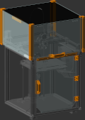

# Parametric OpenSCAD enclosure for ZeroG Mercury One.1

  

The purpose was to have a simple design, needing no additional extrusions, only printed parts and acrylic or aluminium composite panels. 
Also, the top had to be easily removable, with convenient front access, and every cover ideally should be unfastened by means of clips, to allow for quick modifications and tweaks.
The sides are held together by mounts where the panels can slide under and any clip you prefer, used this personally [Voron 2.4 Filament Latch](https://www.printables.com/model/172368-voron-24-filament-latch-or-any-2020-extrusion)

The files are parametric, you can tweak to your particular size and thickness. The generated STL and DXF files are for a standard Ender 5, with 4mm panel/acrylic thickness.

You can tweak config.scad to your own dimensions. STL files can be generated using OpenSCAD. The DXF files were generated by exporting the SVG of the projections using OpenSCAD, then converting to DXF in Inkscape, as the OpenSCAD DXF output did not work well for me.

These are pictures of the finished enclosure:

